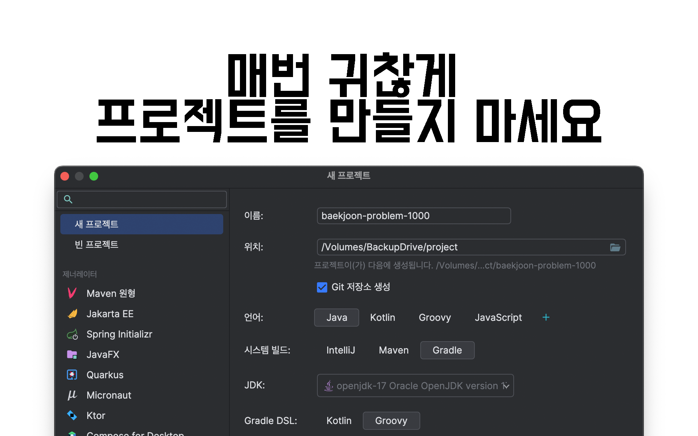
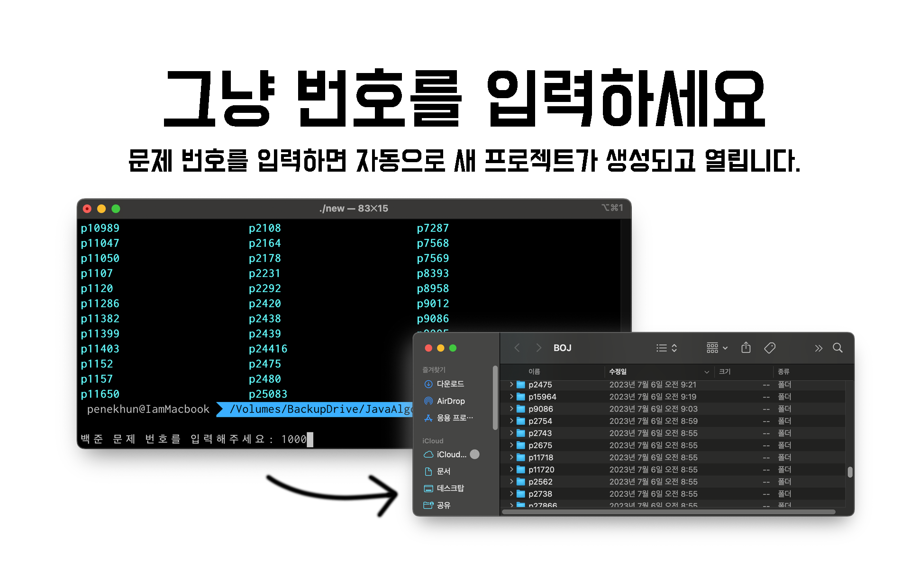
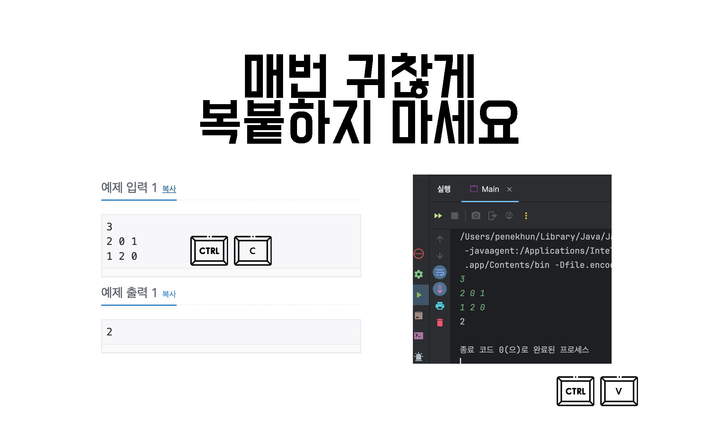
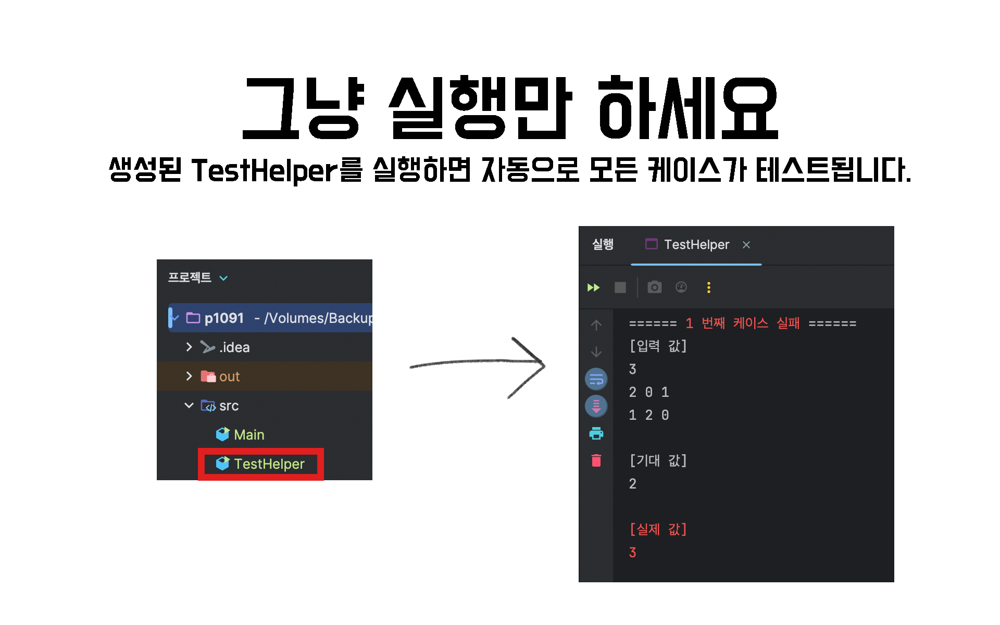

# Baekjoon-java-starter

해당 프로젝트는 자바를 이용하여 백준 문제를 풀때, 프로젝트 생성 및 테스트 케이스 자동 생성을 지원합니다.  
**"여러분은 단지 문제 풀이에만 집중하면 됩니다."**






## 어떻게 작동하나요?

프로그램을 사용하려면 먼저 문제 번호를 입력하세요. 그러면 `p문제번호`라는 디렉터리가 생성되며, 그 안에 `Main.java`와 `TestHelper.java` 파일이 자동으로
만들어집니다. 그 후에는 인텔리제이가 실행됩니다.

`Main.java` 파일 내의 main 함수에 코드를 작성하고, 작성한 코드를 테스트하려면 `TestHelper.java`를 실행하면 됩니다. 이렇게 하면 테스트가 자동으로
실행됩니다.

최종적으로 백준에 `Main.java`를 복사하여 제출하면 됩니다.

## 요구 환경

- 인터넷 연결  
  백준 사이트에서 문제를 파싱하기 위해 인터넷 연결이 필요합니다.
- JAVA 13 버전 이상
- 인텔리제이

## 설치 및 사용 방법

1. [최신 릴리즈](https://github.com/PENEKhun/Baekjoon-java-starter/releases/latest)
   에서 `Baekjoon-java-starter.zip` 파일을 다운로드합니다.
2. 압축을 풀고 다음 명령어를 실행합니다.

    ```bash
    java -jar Baekjoon-java-starter.jar
    ```

3. 이제 백준 문제 번호를 입력하면 됩니다.

## 라이센스

[](https://opensource.org/licenses/mit-license.php)
